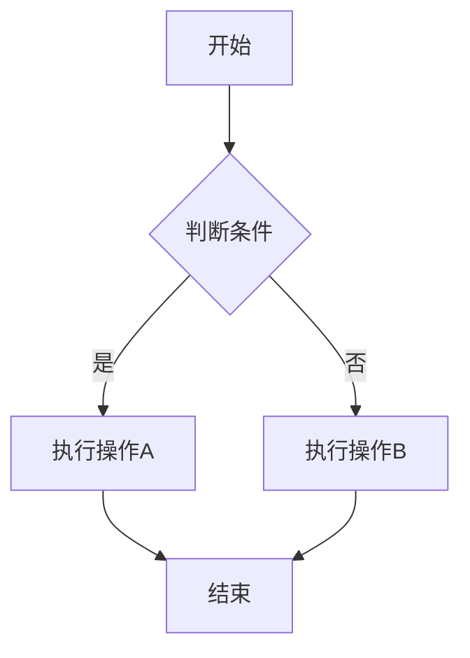
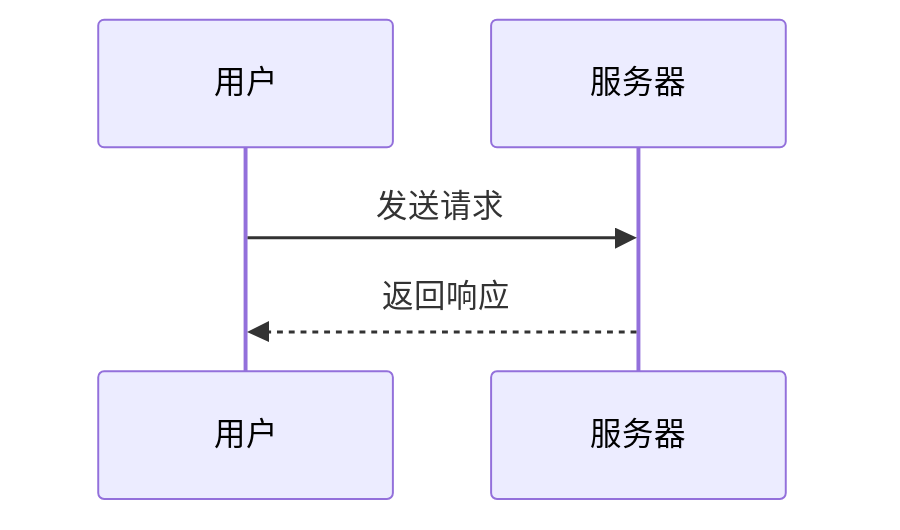

# MDH Core Renderer Test Fixtures

这是一个测试文档，用于验证 Markdown 渲染器的各项功能。

## 基础格式

这是一段普通文本，包含 **粗体**、*斜体*、~~删除线~~ 和 `行内代码`。

这是第二段，测试段落分隔。

### 斜体语法测试

使用星号的斜体：*这是斜体文本*

使用下划线的斜体：_这也是斜体文本_

混合使用：**粗体中的 _斜体_ 文本**

## 列表

### 无序列表

- 项目一
- 项目二
  - 嵌套项目 A
  - 嵌套项目 B
- 项目三

### 深层嵌套列表

- 项目 C
  - 子项目 C1
    - 子子项目 C1a
    - 子子项目 C1b
  - 子项目 C2
- 项目 D

### 有序列表

1. 第一步
2. 第二步
3. 第三步

### 混合嵌套列表

1. 有序项目一
   - 无序子项目 A
   - 无序子项目 B
2. 有序项目二
   1. 有序子项目 1
   2. 有序子项目 2

## 数学公式

### 行内公式

爱因斯坦质能方程：$E=mc^2$

二次方程求根公式：$x = \frac{-b \pm \sqrt{b^2-4ac}}{2a}$

勾股定理：$a^2 + b^2 = c^2$

### 块级公式

$$
\int_{-\infty}^{\infty} e^{-x^2} dx = \sqrt{\pi}
$$

$$
\sum_{n=1}^{\infty} \frac{1}{n^2} = \frac{\pi^2}{6}
$$

## 代码块

### JavaScript

```javascript
function greet(name) {
  const message = `Hello, ${name}!`;
  console.log(message);
  return message;
}

// 调用函数
greet('World');
```

### Python

```python
def greet(name):
    """打招呼函数"""
    message = f"Hello, {name}!"
    print(message)
    return message

# 调用函数
greet("World")
```

### 无语言标识

```
这是一段没有指定语言的代码块
应该降级为纯文本显示
```

### 不支持的语言

```unknownlang
这是一段使用不支持语言的代码块
应该降级为纯文本显示
```

## 链接和图片

这是一个 [链接示例](https://example.com "示例网站")。

这是一个图片：


## 引用

> 这是一段引用文本。
> 可以包含多行。
>
> 也可以有段落分隔。

## 表格

| 名称 | 类型 | 描述 |
|------|------|------|
| id | number | 唯一标识 |
| name | string | 名称 |
| active | boolean | 是否激活 |

## 分隔线

上面的内容

---

下面的内容

## 安全测试

以下内容应该被过滤：

<script>alert('XSS')</script>

<a href="javascript:alert('XSS')">恶意链接</a>

<div onclick="alert('XSS')">点击事件</div>

## 智能标点

测试智能标点转换：

- 箭头：--> <-- <-->
- 破折号：这是一个--测试
- 引号："双引号" '单引号'
- 省略号：...

## 结束

测试文档结束。

## Mermaid 图表

### 流程图



### 时序图


